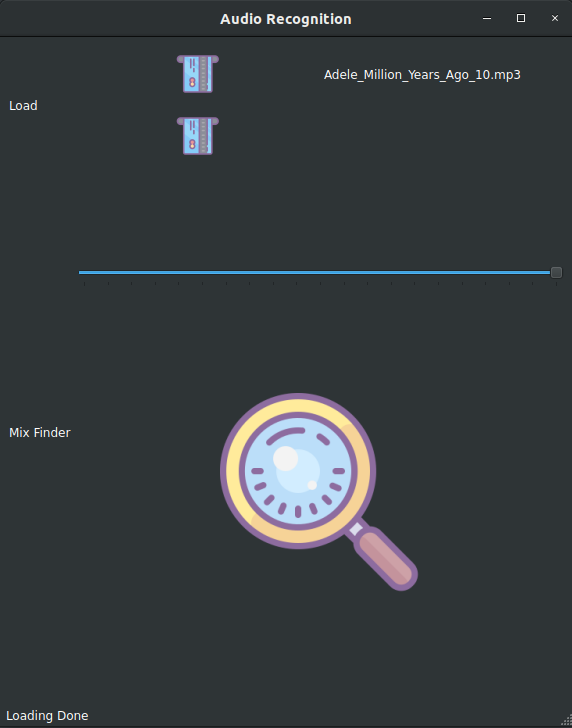
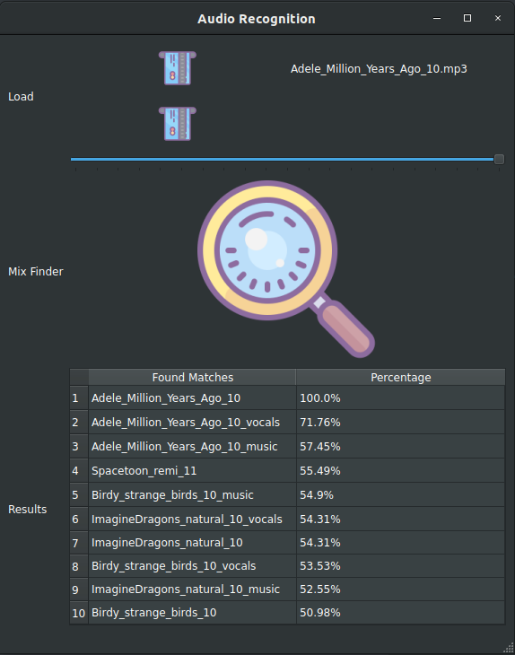

# voice-recognition
A basic implementation of a Audio Recognition algorithm, it utilizes the advantages of a spectrogram and perceptual hashing, implementation is as follows :

- A database is formed of 75 songs (Audio File) separated to their Vocal and Musical features.
- Extraction of Spectrogram and spectral Features (Mel Spectrogram, Mel frequency Coefficient and Chroma STFT) is executed.
- Hashing the extracted data with a Perceptual Hashing Algorithm.
- A test Song (Audio File) is given to the application with extraction of its Hash the matches are found.
- Matching percentages are calculated according to a mapping algorithm and then sorted to the user
- A testing mechanism is implemented by mixing two Audio files then this mix is given to the application to find it's matches in the database

## Basic Usage 

This is a simple usage application only for testing the Recognition algorithm :

- Load desired Audio File with max 2 files

   

- Select the desired slider value from 0 to 100%

- Click on the Search button 

